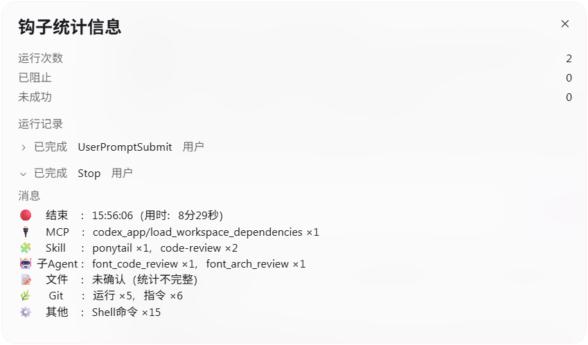

# Codex Task Stats

**简体中文** · [English](README_EN.md)

当前版本：**v3.0**。

> 为 Windows 原生 Codex 工作流提供隐私优先的任务统计：自动汇总用时、MCP、Skill、子Agent、文件变更、Git 和本地工具调用，让每一次 AI 编码任务都有清晰、可追溯的执行摘要。

<p align="center">
  
</p>

默认居中的实际运行截图；文件变更证据不足时会显示“统计不完整”。

Codex 可以完成很长、很复杂的任务，但任务结束后常常很难快速回答这些问题：**到底跑了多久？用了哪些 MCP？调用了哪些 Skill？启动了几个子Agent？改了多少文件？Git 做了什么？**

Codex Task Stats 通过用户级 Hook 自动收集这些信息：客户端只显示一条紧凑的任务摘要，更详细的安全日志则按天保存在本地。同一个 Codex Home 下的项目无需重复配置。

如果它让你的长任务更容易理解、复盘和排查，欢迎给项目一个 Star ⭐。

## 亮点

- **零侵入任务摘要**：任务开始显示时间，结束自动汇总用时与关键活动。
- **MCP 真实调用统计**：按 `server/tool` 聚合，只统计实际执行的调用。
- **Skill 多源识别**：结合结构化输入、transcript、子Agent记录、显式标记与 `SKILL.md` 读取证据。
- **子Agent 统计**：优先按真实 `agent_id` 去重，并在能够安全关联时显示可读角色名称；缺少生命周期时保留成功创建调用的回退计数。
- **文件变更统计**：以成功 `FileChange` 记录汇总新增、修改、删除；重命名和移动分别计入原路径删除、新路径新增。
- **Git 语义统计**：区分 Git 运行、指令和真正的变更操作；`status`、`diff`、dry-run 等只读行为不会被当成变更。
- **隐私优先日志**：命令默认以 `safe` 模式保存，敏感参数、远程地址、自由文本和工作区外路径会被隐藏。
- **本地、按日、可读**：无需服务端、数据库或额外面板，日志直接落在 Codex Home。
- **面向 Windows PowerShell 5.1**：安装、状态检查和核心回归测试都针对原生 Windows 环境设计。

## 它会显示什么

以下摘要和后文的日志均为展示示例，不代表同一次任务；具体项目和数量以实际运行为准。

任务开始：

```text
🟢    开始    ：14:07:08
```

任务结束：

```text
🔴    结束    ：14:08:34（用时：1分26秒）
🔌    MCP    ：mysql_7/query ×2
🧩    Skill     ：analyze ×1
🤖 子Agent ：code_reviewer ×1，architect ×1
📝    文件    ：修改 ×3
🌿     Git      ：运行 ×2，指令 ×6，变更 ×1
⚙️    其他    ：Shell命令 ×2
```

没有数据的分类会自动隐藏。成功任务默认不显示“状态：完成”；失败、已中断或未知状态才会额外显示状态。

程序默认启用 `display.multiline: true`，按分类输出真实换行；设为 `false` 可恢复以 `｜` 分隔的单行摘要。实际显示效果取决于客户端。配置含义、验证结果和排查方法见 [Hook 展示与换行排查](HOOK_DISPLAY.md)。

多行模式下，开始、追加输入提示及结束摘要默认使用 `display.labelAlignment: "center"` 居中标签，也可设置为 `left`、`right` 或 `none`。按 Windows 参考字体宽度计算普通空格，字体测量不可用时回退到字符列宽估算；实际视觉效果取决于客户端字体。单行及括号样式保持原格式，文档代码块仅展示输出文本。

修改已安装的配置文件即可调整这些选项，文件位置见[本地日志与配置](#本地日志与配置)。

## Hook 在哪里显示

完成安装及客户端要求的 Hook 信任审核后，Hook 会出现在 Codex / ChatGPT 客户端的对话时间线中：`UserPromptSubmit` 在任务开始时显示开始时间，`Stop` 在任务结束时显示统计摘要。其他中间 Hook 默认静默采集，不会持续打断对话。

<p align="center">
  
</p>

截图中的红框标出回答下方的 Hook 统计入口，点击后可查看统计详情。入口位置和客户端外观可能随版本变化。

## v3.0 更新与升级

v3.0 汇总了 v2.1 以来的统计与展示改动：按单轮回答计时，完善追加输入和上下文压缩后的恢复；文件统计基于成功的 `FileChange` 记录与最终内容核验；子Agent支持经过身份及执行记录校验的续跑关联；多行摘要默认居中，并支持左对齐、右对齐和不对齐。

程序版本与配置格式版本独立，`schemaVersion` 仍为 `11`。旧的文件 Git 状态扫描配置不再参与文件计数，统计结果不保证与旧版一致；未上报的写操作仍可能遗漏，证据不足时显示“统计不完整”。

升级时使用原安装的 Codex Home。直接运行安装脚本会备份并迁移现有配置；要采用当前推荐显示与采集选项，可再运行 `scripts/apply-recommended-display.ps1`，它会覆盖对应选项。若希望清除旧程序与统计状态，先备份自定义配置，再运行 `scripts/uninstall.ps1 -RemoveProgram -Confirm:$false`，然后重新安装；该卸载方式保留日志和备份，但会移除配置，重装后使用默认配置。显式指定 Codex Home 时，各脚本都应使用相同的 `-CodexHome` 参数。

升级或重装后运行 `scripts/status.ps1`，完全重启客户端，并按客户端提示完成 Hook 信任审核及新任务验证。历史日志保留原程序版本。

## 快速开始

### 环境要求

- Windows 11
- 原生 Codex / ChatGPT 客户端的 Windows Agent 环境
- Windows PowerShell 5.1
- 当前 Windows 用户可写的 Codex Home

### 1. 克隆或下载仓库

进入仓库根目录，确认可以看到：

```text
src/
scripts/
config/
tests/
```

### 2. 先运行回归测试

```powershell
powershell.exe -NoLogo -NoProfile -NonInteractive `
  -ExecutionPolicy Bypass `
  -File ".\scripts\test.ps1"
```

只有测试全部通过后再安装。

### 3. 安装

默认 Codex Home：

```powershell
powershell.exe -NoLogo -NoProfile -NonInteractive `
  -ExecutionPolicy Bypass `
  -File ".\scripts\install.ps1" `
  -IntermediateMode Quiet
```

自定义 Codex Home：

```powershell
powershell.exe -NoLogo -NoProfile -NonInteractive `
  -ExecutionPolicy Bypass `
  -File ".\scripts\install.ps1" `
  -CodexHome "E:\.codex" `
  -IntermediateMode Quiet
```

Codex Home 解析优先级：

```text
-CodexHome 参数
→ CODEX_HOME 环境变量
→ 当前用户目录\.codex
```

安装器会安全合并属于 Codex Task Stats 的 Hook，不要求手工覆盖整个 `hooks.json`。

### 4. 检查状态

```powershell
powershell.exe -NoLogo -NoProfile -NonInteractive `
  -ExecutionPolicy Bypass `
  -File ".\scripts\status.ps1"
```

状态脚本会检查运行时文件、语法、配置、Hook 注册和关键兼容探针。

检查状态时应使用与安装时相同的 Codex Home。若安装时显式指定了目录，在上述命令末尾追加相同的参数，例如 `-CodexHome "E:\.codex"`；使用默认解析方式时，保持 `CODEX_HOME` 环境变量与安装时一致。

### 5. 审核 Hook 并验证首次运行

按照当前客户端提示，审核并信任新增或变更的 Hook 定义。非托管 Hook 在获得信任前会被跳过；更新定义后可能需要重新审核。Codex CLI 可通过 `/hooks` 管理信任；桌面客户端以其实际提示为准。详见[官方 Hook 信任说明](https://learn.chatgpt.com/docs/hooks#review-and-trust-hooks)。

完成审核后，运行一个新任务，确认出现开始提示、结束摘要，并在[本地日志目录](#本地日志与配置)生成对应记录。状态检查通过不等于已验证客户端能够实际触发 Hook。

## 详细日志示例

客户端摘要保持简洁，完整任务细节按天写入本地日志。一个任务的日志大致如下：

```text
【任务信息】
程序版本：vX.X
开始时间：2026-09-01 14:07:08 +08:00
结束时间：2026-09-01 14:08:34 +08:00
用时：1分26秒

【执行结果】
状态：完成

【调用统计】
MCP：
  - mysql_7/query ×2
Skill：
  - analyze ×1
  - code-review ×2
子Agent：
  - code_reviewer ×1
  - architect ×1
Git：
  运行 ×2
  指令 ×6
  变更 ×1
其他：
  - Shell命令 ×2

【文件变更】
文件：
  - 修改 ×3

【统计完整性】
总体完整性：部分
```

完整的脱敏示例见 [`examples/detailed-task.log`](examples/detailed-task.log)。真实日志还会包含经过安全处理后的 Git / Shell 命令明细、Skill 采集来源和统计完整性说明。

## 统计口径

### 任务与用时

同一次回答（同一 `turn`）的首次输入显示“开始”，回答中途追加的输入显示“第 N 次输入”和本次输入时间，每次输入独立显示一条提示。正常情况下，`Stop` 的用时从本次回答的首次输入计算到结束；回答结束后的新一轮输入重新计时、计数，不包含两次回答之间的等待时间。追加输入不会重置文件基线、工具次数或 Skill、子Agent统计；旧版全会话计时缓存不再参与统计。

若压缩等中间事件先建立了本轮状态，后到输入保留该状态的起点和已采集记录，因此统计起点可能早于输入提示时间。当前耗时优先使用保存的本轮开始时间与结束时间之差，受系统校时影响；起点不可用时才尝试单调时钟，两者均不可用时显示未知耗时。

开始 Hook 外层超时为 10 秒，内部锁等待为 1 秒，开始时不扫描工作区。

### MCP

只统计实际执行的 MCP，并按 `server/tool` 聚合。同名工具来自不同 MCP Server 时不会合并。

除工具 Hook 外，还会从本轮 transcript 的原生 `McpToolCall` 完成记录补采，并按调用 ID 去重。执行失败但已结束的调用也计次；运行中的调用、缺少稳定 ID 或仅在代码文本中提及工具不补计，参数和返回正文不保存。

### Skill

Skill 采用多源识别。由于客户端事件和 transcript 结构可能变化，它属于**尽力统计**，不应理解为 100% 完整审计。

### 子Agent

有真实身份的子Agent按本轮唯一 `agent_id` 去重。通过 `followup_task` 复用已有子Agent时，成功调用能关联到真实身份，且父子关系和本轮执行记录均通过校验，也会计入；同一子Agent多次续跑仍只计一次，普通消息和等待不会增加数量。可读名称只作为显示增强，不参与身份判断；无法安全、可靠地关联名称时，会回退到生命周期中的 `agent_type`。

汇总中完全没有生命周期启动事件时，已明确成功的创建调用可按稳定调用 ID 回退计数。该回退不代表已确认真实 Agent 身份，不能用来证明续跑或父子关系。

优先显示经过校验的短任务名称，通过创建调用返回的 `agent_id` 或子会话元数据关联身份，不按事件顺序猜测。路径、凭据式名称和提示词不会作为名称保存。

### 文件

客户端显示 `新增 ×N，修改 ×N，删除 ×N`，三类之和为本次回答的已确认变更文件数，不要求与客户端“已编辑”数量完全一致。重命名或移动计原路径删除和新路径新增；同一路径最终只归入一个类别。

按本次回答的成功 `FileChange` 记录去重，利用补丁反推涉及文件的首次内容，只定点读取最终内容。修改后恢复原样、新增后又删除均不计；新增后继续编辑仍计新增，删除后重建按内容是否恢复判断；仅暂存或提交已有修改不增加计数。失败记录不计入，追加输入不清空记录。

不再扫描整个工作区，旧的 `gitStatusTimeoutMs`、`maxGitStatusEntries` 不再参与文件计数。子Agent仅从已知会话目录查找并校验身份，在本次回答时间范围内与主任务记录按时间合并。文本比较统一 CRLF/LF，保留末尾换行差异；原文和补丁只在内存处理，不写入统计状态或日志。

没有上报 `FileChange` 的 Shell、MCP、IDE 写操作可能遗漏。记录截断、补丁缺失或冲突、文件不可读、子Agent记录无法关联时，显示已确认数量及“统计不完整”，日志说明原因。定点读取限制为单文件 4 MiB、最多 1000 个路径和约 32 MiB 文本，读取预算 2 秒、含补丁核验总预算 4 秒；子Agent读取最多 16 个、预算 2 秒，超限明确降级。这里的“已核验”只针对已采集记录，不代表完整磁盘审计。

### Git

```text
🌿 Git：运行 ×N，指令 ×M，变更 ×K
```

- **运行**：一次已完成的 Shell 工具调用中只要包含 Git 指令，就计一次。
- **指令**：顶层 `git` / `git.exe` / `git.cmd` 指令总数。
- **变更**：会改变工作区、暂存区、本地仓库、引用、Git 配置或远程仓库状态的 Git 指令数。

例如：

```powershell
git status; git diff; git add .; git commit -m "message"
```

统计为：

```text
运行 ×1，指令 ×4，变更 ×2
```

文件变化数量和 Git 变更指令数量是两个独立维度，不应该相等。

## 隐私设计

默认命令日志模式：

```json
{
  "commandLogging": {
    "mode": "safe",
    "includeGit": true,
    "includeShell": true
  }
}
```

只支持：

- `safe`：保存安全处理后的命令摘要。
- `off`：不保存命令明细。

**不存在保存原始命令的 `full` 模式。**

项目会尽力隐藏 API Key、Token、Password、Cookie、Authorization、数据库认证信息、带认证 URL、Git remote 凭证、commit message、自由文本参数、工作区外绝对路径，以及无法证明可以安全保存的参数。

项目不会记录命令 `stdout`、`stderr`、工具返回正文或每条命令的独立用时。安全模式遵循一个简单原则：**无法安全判断时，宁可隐藏整条命令。**

公开提交 Issue 或日志前，请再次检查是否包含凭证、私有路径或业务数据；`safe` 是尽力而为的安全渲染机制，不是通用 DLP 或合规审计系统。

## 本地日志与配置

默认日志位置：

```text
<CodexHome>\task-stats\logs\codex-task-YYYY-MM-DD.log
```

每个任务包含任务信息、执行结果、调用统计、文件变更、Skill 采集和统计完整性等区域。日志不使用 Emoji，方便搜索、Diff 和脚本处理。

日志写入失败时，摘要会提示失败，并保留冻结的汇总及原始统计数据。同一任务再次收到 `Stop` 时会重试补写，成功后才清理原始数据；补写使用第一次结束时的内容与时间，不重新统计。这不是后台自动重试。

安装后的配置位于：

```text
<CodexHome>\task-stats\config\config.json
```

仓库中的 [`config/config.example.json`](config/config.example.json) 是默认配置参考，可配置客户端分类图标与标签、Skill transcript 读取范围、中间 Hook 安静模式、日志开关、命令日志策略和工具别名。文件统计口径与旧配置的适用边界见[文件统计说明](#文件)。

## 卸载

只移除 Hook：

```powershell
powershell.exe -NoLogo -NoProfile -NonInteractive `
  -ExecutionPolicy Bypass `
  -File ".\scripts\uninstall.ps1"
```

卸载时同样使用安装时的 Codex Home。若安装时显式指定了目录，在上述命令末尾追加相同的 `-CodexHome` 参数；使用默认解析方式时，保持 `CODEX_HOME` 环境变量与安装时一致。

完整选项：

```powershell
Get-Help .\scripts\uninstall.ps1 -Full
```

卸载脚本会先备份 `hooks.json`，并且只移除属于 Codex Task Stats 的处理器。

## 项目结构

```text
codex-task-stats/
├── assets/                # README 预览图
├── config/                # 默认配置
├── examples/              # 脱敏日志示例
├── scripts/               # 安装、状态、测试、卸载
├── src/                   # Hook 主处理器与子Agent关联逻辑
├── tests/                 # 核心回归测试与最小样本
├── hooks.template.json    # Hook 结构参考
├── README.md
├── README_EN.md
└── LICENSE
```

## 已知边界

- Skill 统计依赖可观察到的结构化事件、transcript 和 `SKILL.md` 读取证据，格式变化可能造成遗漏。
- 某些托管工具可能没有完整的标准 Hook 事件。
- Shell 间接产生的文件变化不一定能够完整归因。
- 子Agent显示名称只有在能够安全且可靠关联时才会使用；成功创建调用的回退计数不代表已确认真实 Agent 身份。
- 当前不统计 Token 或缓存命中率。
