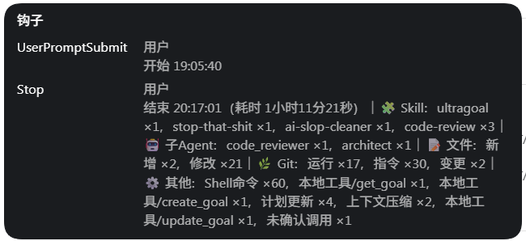

# Codex Task Stats

**简体中文** · [English](README_EN.md)

> 为 Windows 原生 Codex 工作流提供隐私优先的任务统计：自动汇总耗时、MCP、Skill、子Agent、文件变更、Git 和本地工具调用，让每一次 AI 编码任务都有清晰、可追溯的执行摘要。

<p align="center">
  
</p>

Codex 可以完成很长、很复杂的任务，但任务结束后常常很难快速回答这些问题：**到底跑了多久？用了哪些 MCP？调用了哪些 Skill？启动了几个子Agent？改了多少文件？Git 做了什么？**

Codex Task Stats 通过用户级 Hook 自动收集这些信息：客户端只显示一条紧凑的任务摘要，更详细的安全日志则按天保存在本地。同一个 Codex Home 下的项目无需重复配置。

如果它让你的长任务更容易理解、复盘和排查，欢迎给项目一个 Star ⭐。

## 亮点

- **零侵入任务摘要**：任务开始显示时间，结束自动汇总耗时与关键活动。
- **MCP 真实调用统计**：按 `server/tool` 聚合，只统计实际执行的调用。
- **Skill 多源识别**：结合结构化输入、transcript、子Agent记录、显式标记与 `SKILL.md` 读取证据。
- **子Agent 统计**：按真实 `agent_id` 去重，并在能够安全关联时显示可读角色名称。
- **文件变更统计**：汇总新增、修改、删除；重命名和移动按同一逻辑文件处理。
- **Git 语义统计**：区分 Git 运行、指令和真正的变更操作；`status`、`diff`、dry-run 等只读行为不会被当成变更。
- **隐私优先日志**：命令默认以 `safe` 模式保存，敏感参数、远程地址、自由文本和工作区外路径会被隐藏。
- **本地、按日、可读**：无需服务端、数据库或额外面板，日志直接落在 Codex Home。
- **面向 Windows PowerShell 5.1**：安装、状态检查和核心回归测试都针对原生 Windows 环境设计。

## 它会显示什么

任务开始：

```text
开始 14:07:08
```

任务结束：

```text
结束 14:08:34（耗时 1分26秒）｜🔌 MCP：mysql_7/query ×2｜🧩 Skill：analyze ×1｜🤖 子Agent：code_reviewer ×1，architect ×1｜📝 文件：修改 ×3｜🌿 Git：运行 ×2，指令 ×6，变更 ×1｜⚙️ 其他：Shell命令 ×2
```

没有数据的分类会自动隐藏。成功任务默认不显示“状态：完成”；失败、已中断或未知状态才会额外显示状态。

客户端可能因为卡片宽度自动折行，程序本身生成的是以 `｜` 分隔的逻辑单行摘要。

## Hook 在哪里显示

安装成功后，Hook 会直接出现在 Codex / ChatGPT 客户端的对话时间线中：`UserPromptSubmit` 在任务开始时显示开始时间，`Stop` 在任务结束时显示统计摘要。其他中间 Hook 默认静默采集，不会持续打断对话。

<p align="center">
  
</p>

上面的动图演示了 Hook 卡片所在的位置。客户端外观可能随版本变化，但统计信息仍会作为 Hook 事件出现在当前任务附近。

## 快速开始

### 环境要求

- Windows 11
- 原生 Codex / ChatGPT 客户端的 Windows Agent 环境
- Windows PowerShell 5.1
- 当前 Windows 用户可写的 Codex Home

### 1. 克隆或下载仓库

进入仓库根目录，确认可以看到：

```text
src/
scripts/
config/
tests/
```

### 2. 先运行回归测试

```powershell
powershell.exe -NoLogo -NoProfile -NonInteractive `
  -ExecutionPolicy Bypass `
  -File ".\scripts\test.ps1"
```

只有测试全部通过后再安装。

### 3. 安装

默认 Codex Home：

```powershell
powershell.exe -NoLogo -NoProfile -NonInteractive `
  -ExecutionPolicy Bypass `
  -File ".\scripts\install.ps1" `
  -IntermediateMode Quiet
```

自定义 Codex Home：

```powershell
powershell.exe -NoLogo -NoProfile -NonInteractive `
  -ExecutionPolicy Bypass `
  -File ".\scripts\install.ps1" `
  -CodexHome "E:\.codex" `
  -IntermediateMode Quiet
```

Codex Home 解析优先级：

```text
-CodexHome 参数
→ CODEX_HOME 环境变量
→ 当前用户目录\.codex
```

安装器会安全合并属于 Codex Task Stats 的 Hook，不要求手工覆盖整个 `hooks.json`。

### 4. 检查状态

```powershell
powershell.exe -NoLogo -NoProfile -NonInteractive `
  -ExecutionPolicy Bypass `
  -File ".\scripts\status.ps1" `
  -CodexHome "E:\.codex"
```

状态脚本会检查运行时文件、语法、配置、Hook 注册和关键兼容探针。

## 详细日志示例

客户端摘要保持简洁，完整任务细节按天写入本地日志。一个任务的日志大致如下：

```text
【任务信息】
程序版本：vX.X
开始时间：2026-09-01 14:07:08 +08:00
结束时间：2026-09-01 14:08:34 +08:00
耗时：1分26秒

【执行结果】
状态：完成

【调用统计】
MCP：
  - mysql_7/query ×2
Skill：
  - analyze ×1
  - code-review ×2
子Agent：
  - code_reviewer ×1
  - architect ×1
Git：
  运行 ×2
  指令 ×6
  变更 ×1
其他：
  - Shell命令 ×2

【文件变更】
文件：
  - 修改 ×3

【统计完整性】
总体完整性：部分
```

完整的脱敏示例见 [`examples/detailed-task.log`](examples/detailed-task.log)。真实日志还会包含经过安全处理后的 Git / Shell 命令明细、Skill 采集来源和统计完整性说明。

## 统计口径

### MCP

只统计实际执行的 MCP，并按 `server/tool` 聚合。同名工具来自不同 MCP Server 时不会合并。

### Skill

Skill 采用多源识别。由于客户端事件和 transcript 结构可能变化，它属于**尽力统计**，不应理解为 100% 完整审计。

### 子Agent

子Agent按唯一 `agent_id` 去重。可读名称只作为显示增强，不参与身份判断；无法安全、可靠地关联名称时，会回退到生命周期中的 `agent_type`。

### 文件

客户端显示 `新增 ×N，修改 ×N，删除 ×N`。重命名或移动统一视为“修改”，并按逻辑文件去重。

### Git

```text
🌿 Git：运行 ×N，指令 ×M，变更 ×K
```

- **运行**：一次已完成的 Shell 工具调用中只要包含 Git 指令，就计一次。
- **指令**：顶层 `git` / `git.exe` / `git.cmd` 指令总数。
- **变更**：会改变工作区、暂存区、本地仓库、引用、Git 配置或远程仓库状态的 Git 指令数。

例如：

```powershell
git status; git diff; git add .; git commit -m "message"
```

统计为：

```text
运行 ×1，指令 ×4，变更 ×2
```

文件变化数量和 Git 变更指令数量是两个独立维度，不应该相等。

## 隐私设计

默认命令日志模式：

```json
{
  "commandLogging": {
    "mode": "safe",
    "includeGit": true,
    "includeShell": true
  }
}
```

只支持：

- `safe`：保存安全处理后的命令摘要。
- `off`：不保存命令明细。

**不存在保存原始命令的 `full` 模式。**

项目会尽力隐藏 API Key、Token、Password、Cookie、Authorization、数据库认证信息、带认证 URL、Git remote 凭证、commit message、自由文本参数、工作区外绝对路径，以及无法证明可以安全保存的参数。

项目不会记录命令 `stdout`、`stderr`、工具返回正文或每条命令的独立耗时。安全模式遵循一个简单原则：**无法安全判断时，宁可隐藏整条命令。**

公开提交 Issue 或日志前，请再次检查是否包含凭证、私有路径或业务数据；`safe` 是尽力而为的安全渲染机制，不是通用 DLP 或合规审计系统。

## 本地日志与配置

默认日志位置：

```text
<CodexHome>\task-stats\logs\codex-task-YYYY-MM-DD.log
```

每个任务包含任务信息、执行结果、调用统计、文件变更、Skill 采集和统计完整性等区域。日志不使用 Emoji，方便搜索、Diff 和脚本处理。

安装后的配置位于：

```text
<CodexHome>\task-stats\config\config.json
```

仓库中的 [`config/config.example.json`](config/config.example.json) 是默认配置参考，可配置客户端分类图标与标签、Skill transcript 读取范围、文件 Git 状态补充、中间 Hook 安静模式、日志开关、命令日志策略和工具别名。

## 卸载

只移除 Hook：

```powershell
powershell.exe -NoLogo -NoProfile -NonInteractive `
  -ExecutionPolicy Bypass `
  -File ".\scripts\uninstall.ps1" `
  -CodexHome "E:\.codex"
```

完整选项：

```powershell
Get-Help .\scripts\uninstall.ps1 -Full
```

卸载脚本会先备份 `hooks.json`，并且只移除属于 Codex Task Stats 的处理器。

## 项目结构

```text
codex-task-stats/
├── assets/                # README 预览图
├── config/                # 默认配置
├── examples/              # 脱敏日志示例
├── scripts/               # 安装、状态、测试、卸载
├── src/                   # Hook 主处理器与子Agent关联逻辑
├── tests/                 # 核心回归测试与最小样本
├── hooks.template.json    # Hook 结构参考
├── README.md
├── README_EN.md
└── LICENSE
```

## 已知边界

- Skill 统计依赖可观察到的结构化事件、transcript 和 `SKILL.md` 读取证据，格式变化可能造成遗漏。
- 某些托管工具可能没有完整的标准 Hook 事件。
- Shell 间接产生的文件变化不一定能够完整归因。
- 子Agent显示名称只有在能够安全且可靠关联时才会使用；身份计数仍以 `agent_id` 为准。
- 当前不统计 Token 或缓存命中率。

