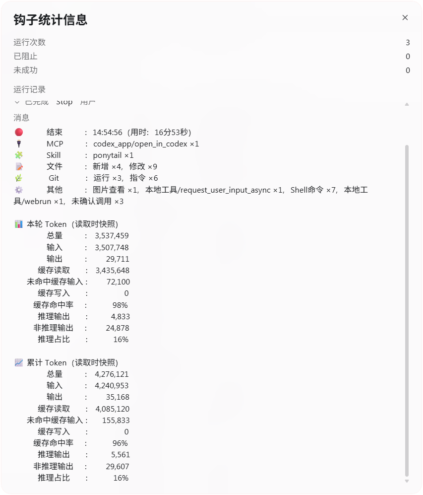

# Codex Task Stats

[简体中文](README.md) · **English**

[Quick start](#quick-start) · [Counting semantics](#counting-semantics) · [Configuration reference](CONFIGURATION_EN.md) · [Changelog](CHANGELOG_EN.md) · [Contributing](CONTRIBUTING_EN.md) · [Security](SECURITY_EN.md)

> Privacy-first task telemetry for native Codex workflows on Windows. Track duration, MCP tools, Skills, subagents, file changes, Git activity, local tools, and Token usage for the current conversation.

<p align="center">
  
</p>

User-provided runtime screenshot showing MCP, Skills, files, Git, other activity, and turn/current-conversation Token sections. Incomplete file-change evidence produces an incomplete-statistics notice.

Codex can spend a long time on complex tasks, but once a task finishes it can be surprisingly hard to answer simple questions: **How long did it run? Which MCP tools were used? Which Skills were invoked? How many subagents were started? How many files changed? What did Git actually do?**

Codex Task Stats answers those questions with user-level Hooks. The client gets one compact completion summary, while a more detailed, safety-rendered log is stored locally by day. Every project sharing the same Codex Home can use the same installation.

If it makes long-running Codex work easier to understand, review, and debug, consider starring the project ⭐.

## Highlights

- **Zero-friction task summaries** — show the start time and automatically summarize the task when it ends.
- **Token snapshots** — show ten metrics for the turn and current conversation by default, with scope and field selection. See [Token statistics](#token-statistics) for the source and limitations.
- **Real MCP usage** — aggregate actual calls by `server/tool`.
- **Multi-source Skill detection** — combine structured input, transcripts, subagent records, explicit markers, and `SKILL.md` read evidence.
- **Subagent accounting** — prefer real `agent_id` deduplication and readable role names when they can be linked safely; retain successful-creation fallback counts when lifecycle events are absent.
- **File change summaries** — count added, modified and deleted paths from successful `FileChange` records; moves count as deletion of the source and addition of the destination.
- **Git semantics** — distinguish Git runs, commands, and state-changing operations; read-only commands and dry runs are not counted as changes.
- **Privacy-first logs** — `safe` mode hides sensitive arguments, remote addresses, free-form text, and paths outside the workspace.
- **Local and readable** — no service, database, or dashboard required; logs live directly under Codex Home.
- **Windows PowerShell 5.1 focused** — installation, health checks, and the core regression suite target native Windows behavior.

## What it looks like

The summaries below and the log examples later in this document are illustrative and do not represent the same task. Actual entries and counts depend on the run. Code blocks align using monospaced character columns; the screenshot above shows the client layout.

Task start:

```text
🟢      开始      ： 14:07:08
```

Task completion:

```text
🔴      结束      ： 14:08:34（用时：1分26秒）
🔌      MCP       ： mysql_7/query ×2
🧩     Skill      ： analyze ×1
🤖    子Agent     ： code_reviewer ×1，architect ×1
📝      文件      ： 修改 ×3
🌿      Git       ： 运行 ×2，指令 ×6，变更 ×1
⚙️      其他      ： Shell命令 ×2

📊 本轮 Token（读取时快照）
        总量      ： 136,000
        输入      ： 128,000
        输出      ：   8,000
      缓存读取    ：  96,000
   未命中缓存输入 ：  32,000
      缓存写入    ：       0
     缓存命中率   ：     75%
      推理输出    ：   5,000
     非推理输出   ：   3,000
      推理占比    ：     63%

📈 累计 Token（读取时快照）
        总量      ： 816,000
        输入      ： 768,000
        输出      ：  48,000
      缓存读取    ： 576,000
   未命中缓存输入 ： 192,000
      缓存写入    ：       0
     缓存命中率   ：     75%
      推理输出    ：  30,000
     非推理输出   ：  18,000
      推理占比    ：     63%
```

Empty categories are hidden automatically. Successful tasks do not show a redundant “completed” status; failure, interruption, or unknown states are displayed explicitly.

The client may wrap the card depending on available width. By default, Codex Task Stats enables `display.multiline` and inserts real line breaks between categories. Setting it to `false` restores one logical line separated with `｜`. How line breaks appear depends on the client. See [Hook display and newline diagnostics (Chinese)](HOOK_DISPLAY.md) for configuration semantics, verification results, and troubleshooting.

In multiline mode, start notifications, additional-input notifications, and completion summaries default to `display.labelAlignment: "center"`. Use `left`, `right`, or `none` to change alignment. Padding uses plain spaces calculated from the Windows reference font; character-width estimates are used if font measurement is unavailable. Visual alignment depends on the client font. Single-line and bracket styles retain their existing format. Code-block examples show the output text, not its appearance in the client.

Adjust these options in the installed configuration file. See [Local logs and configuration](#local-logs-and-configuration) for its location.

## Where the Hooks appear

After installation and any Hook trust review required by the client, Hook events appear in the Codex / ChatGPT conversation timeline: `UserPromptSubmit` shows the task start time, while `Stop` shows the final task summary. Intermediate Hooks collect data silently by default, so they do not keep interrupting the conversation.

<p align="center">
  
</p>

The red box in the screenshot highlights the Hook statistics button below the response. Click it to view the details. The button's position and the client appearance may vary by version.

> User-facing task text and local logs intentionally use Simplified Chinese; protocol names, identifiers, file names, and code-facing terms remain unchanged.

## Upgrade and reinstall

See the [changelog](CHANGELOG_EN.md) for feature changes and the [configuration reference](CONFIGURATION_EN.md) for configuration format and compatibility fields.

Use the same Codex Home as the original installation. Running the installer directly backs up and migrates existing configuration. To apply the current recommended display and collection options, run `scripts/apply-recommended-display.ps1` afterward; it overwrites those options. For a clean runtime and statistics state, back up custom configuration, run `scripts/uninstall.ps1 -RemoveProgram -Confirm:$false`, then reinstall. This uninstall mode preserves logs and backups but removes configuration, so reinstallation uses defaults. When specifying Codex Home explicitly, pass the same `-CodexHome` value to every script.

After upgrading or reinstalling, run `scripts/status.ps1`, fully restart the client, and follow its Hook trust prompts before verifying a new task.

## Quick start

### Requirements

- Windows 11
- Native Windows Agent environment in the Codex / ChatGPT client
- Windows PowerShell 5.1
- A writable Codex Home for the current Windows user

These are the target environments; Windows 10, PowerShell 7, WSL, Linux and macOS compatibility is not claimed. The client must support and enable the required Hook events. [Historical display records (Chinese)](HOOK_DISPLAY.md#历史验证记录与适用边界) describe tested environments, not a guaranteed minimum client version.

### 1. Clone or download the repository

Download the source from [GitHub](https://github.com/Luoxu777/codex-task-stats), or run:

```powershell
git clone https://github.com/Luoxu777/codex-task-stats.git
Set-Location codex-task-stats
```

From the repository root you should see:

```text
src/
scripts/
config/
tests/
```

### 2. Run the regression suite first

```powershell
powershell.exe -NoLogo -NoProfile -NonInteractive `
  -ExecutionPolicy Bypass `
  -File ".\scripts\test.ps1"
```

Install only after the full suite passes.

### 3. Install

Default Codex Home:

```powershell
powershell.exe -NoLogo -NoProfile -NonInteractive `
  -ExecutionPolicy Bypass `
  -File ".\scripts\install.ps1" `
  -IntermediateMode Quiet
```

Custom Codex Home:

```powershell
powershell.exe -NoLogo -NoProfile -NonInteractive `
  -ExecutionPolicy Bypass `
  -File ".\scripts\install.ps1" `
  -CodexHome "E:\.codex" `
  -IntermediateMode Quiet
```

Codex Home resolution order:

```text
-CodexHome parameter
→ CODEX_HOME environment variable
→ current-user .codex directory
```

The installer merges only Codex Task Stats handlers into `hooks.json`; it does not require replacing the entire file manually.

The default `Quiet` mode registers intermediate Hooks asynchronously. `Strict` runs them synchronously for stronger ordering, with possible additional waiting and UI entries. To switch, rerun the installer against the same Codex Home with `-IntermediateMode Strict` or `Quiet`; editing `collection.intermediateMode` alone does not update registration. `hooks.template.json` is a structural reference for the default Quiet mode.

If installation reports disabled Hooks in `config.toml`, check the client configuration first. `-Force` only permits installation to continue; it does not enable client Hooks or bypass other checks or trust review. See the [configuration reference](CONFIGURATION_EN.md) for installer options, backups and the settings overwritten by the recommended configuration script.

### 4. Check installation health

```powershell
powershell.exe -NoLogo -NoProfile -NonInteractive `
  -ExecutionPolicy Bypass `
  -File ".\scripts\status.ps1"
```

The status script checks runtime files, syntax, configuration, Hook registration, and key runtime compatibility probes.

Start with `OverallHealthy`, `RegisteredHandlerCount` (normally 9), `ProgramMatchesSource`, `LibraryMatchesSource` and `RuntimeCompatibilityPassed`. Preserve specific failed fields and resolve path, missing-file or configuration problems first. A configuration value of `True` does not prove that the corresponding feature ran.

Use the same Codex Home as the installation. If you supplied a custom directory, append the same argument to the command above, for example `-CodexHome "E:\.codex"`. When using default resolution, keep the `CODEX_HOME` environment variable consistent with the installation.

### 5. Review Hook trust and verify the first run

Follow the current client's prompts to review and trust new or changed Hook definitions. Non-managed Hooks are skipped until trusted; a changed definition may require another review. Codex CLI provides `/hooks` to manage trust; follow the actual prompts in the desktop client. See the [official Hook trust documentation](https://learn.chatgpt.com/docs/hooks#review-and-trust-hooks).

After the review, run a new task and confirm that the start notification, completion summary, and corresponding record in the [local log directory](#local-logs-and-configuration) appear. A successful health check alone does not verify that the client actually triggers the Hooks.

## Detailed log example

The client summary stays compact, while the local daily log preserves more detail. A single task looks roughly like this:

```text
【任务信息】
开始时间：2026-09-01 14:07:08 +08:00
结束时间：2026-09-01 14:08:34 +08:00
用时：1分26秒

【执行结果】
状态：完成

【调用统计】
MCP：
  - mysql_7/query ×2
Skill：
  - analyze ×1
  - code-review ×2
子Agent：
  - code_reviewer ×1
  - architect ×1
Git：
  运行 ×2
  指令 ×6
  变更 ×1
其他：
  - Shell命令 ×2

【文件变更】
文件：
  - 修改 ×3

【统计完整性】
总体完整性：部分
```

See [`examples/detailed-task.log`](examples/detailed-task.log) for a full sanitized sample. Real logs can also include safety-rendered Git / Shell command details, Skill evidence sources, and completeness notes.

## Counting semantics

### Tasks and elapsed time

The first input in each response (`turn`) shows its start time; additional inputs during that response each show their sequence number and input time in a separate notification. Normally, `Stop` measures elapsed time from that response's first input to its end. A new response resets timing and numbering, excluding idle time between responses. Additional inputs preserve file baselines, tool counts, Skills, and subagent statistics. Legacy session-wide timing caches are no longer used.

If an intermediate event such as compaction creates the turn state before the input arrives, the later input preserves that state's start time and collected records. The statistics may therefore start earlier than the input notification. Elapsed time currently prefers the difference between the saved turn start and end times and is affected by system clock adjustments. The monotonic clock is a fallback when the saved start is unavailable; if neither is usable, elapsed time is shown as unknown.

The start Hook has a 10-second outer timeout and a 1-second internal lock wait; it does not scan the workspace.

### MCP

Only actually executed MCP calls are counted, aggregated by `server/tool`. Identically named tools from different MCP servers remain separate.

In addition to tool Hooks, native `McpToolCall` completion records in the current turn's transcript can supply missing calls, deduplicated by call ID. Failed but ended calls also count. Running calls, records without a stable ID, and tool names merely mentioned in code do not supply counts. Arguments and response bodies are not saved.

### Skills

Skill detection is multi-source and intentionally best-effort. Changes in client events or transcript structure can cause omissions, so it should not be treated as a perfect audit trail.

`Skill ×N` is deduplicated by scope and Skill name within the turn. Repeated reads in the same scope count once; the main task and one linked subagent both using `analyze` can produce `analyze ×2`. This is not an exact count of Skill executions.

Evidence distinguishes confirmed use, file reads and explicit requests. Without stronger evidence, a `$skill` prompt marker may supply a requested-use fallback, which does not prove execution. The highest-priority evidence for the same scope and name is retained. Consult the log's collection sources and evidence levels to interpret the count.

### Subagents

Subagents with a verified identity are deduplicated by `agent_id` within each turn. An existing subagent reused through `followup_task` is also counted when the successful call can be linked to its identity and both the parent-child relationship and execution records for the current turn are verified. Repeated follow-ups to the same subagent count once; ordinary messages and waits do not increase the count. Human-readable names are display-only evidence; if a safe and reliable mapping is unavailable, the lifecycle `agent_type` is used instead.

When the aggregate contains no lifecycle start events, explicitly successful creation calls can supply fallback counts using stable call IDs. These fallback IDs do not establish a real Agent identity and cannot prove reuse or a parent-child relationship.

Validated short task names are preferred. Names are linked through the `agent_id` returned by the creation call or through child-session metadata, never by event order. Paths, credential-like names, and prompts are not saved as display names.

### Files

The client shows added, modified and deleted counts. Their sum is the confirmed total for this response, not necessarily the client's edited-file count. Moves count as source deletion and destination addition; each path belongs to at most one final category.

Successful `FileChange` records are deduplicated per response. Patches reconstruct initial content using targeted final-file reads. Reverted edits and create/delete pairs cancel; edits to newly created files remain additions. Delete/recreate pairs depend on final content. Staging or committing existing changes adds no file count. Failed records are excluded; mid-turn input preserves prior records.

There is no workspace scan; legacy `gitStatusSupplement`, `gitStatusTimeoutMs` and `maxGitStatusEntries` settings no longer affect file counts. Child transcripts are located only in the known transcript directory, checked against parent/child identities and restricted to the response time window. Changes are merged chronologically. CRLF/LF are normalized and one leading file BOM is ignored, while body content and final-newline differences are retained. Source text and diffs remain in memory, never in telemetry state or logs.

Shell, MCP or IDE writes without `FileChange` records may be missed. Missing/conflicting patches, unreadable files, truncated records or unavailable child transcripts produce confirmed counts plus an incomplete notice and a logged reason. Targeted reads allow 4 MiB per file, 1000 paths and approximately 32 MiB of text; reading has a 2-second budget and reconstruction a 4-second total budget. Child collection allows 16 agents and 2 seconds. Verification covers collected records, not a complete disk audit.

### Git

```text
Git: runs ×N, commands ×M, changes ×K
```

- **Run** — one completed Shell tool invocation that contains at least one Git command.
- **Command** — total top-level `git` / `git.exe` / `git.cmd` commands.
- **Change** — Git commands that can modify the worktree, index, local repository, refs, Git configuration, or a remote repository.

For example:

```powershell
git status; git diff; git add .; git commit -m "message"
```

is counted as:

```text
runs ×1, commands ×4, changes ×2
```

File-change counts and Git-change command counts are intentionally separate dimensions.

### Other activity

Other activity includes Shell commands, plan updates, image viewing and the events below. Git, file edits and Agent management tools follow their own classification rules, so this category is not a total of all tool calls.

| Display | Meaning |
| --- | --- |
| `权限请求` | Observed `PermissionRequest` events; controlled by `collection.includePermissionRequests` |
| `上下文压缩` | Observed `PostCompact` events; controlled by `collection.includeCompaction` |
| `未确认调用` | A pre-call record without a matching completion at summary time; this does not establish failure |
| `本地工具/名称` | A local tool without a dedicated category or alias |

## Privacy model

Default command logging:

```json
{
  "commandLogging": {
    "mode": "safe",
    "includeGit": true,
    "includeShell": true
  }
}
```

Supported modes:

- `safe` — persist only safety-rendered command summaries.
- `off` — do not persist command details.

There is **no `full` mode for raw command persistence**.

The renderer attempts to hide API keys, tokens, passwords, cookies, authorization data, database credentials, authenticated URLs, Git remote credentials, commit messages, free-form arguments, absolute paths outside the workspace, and arguments that cannot be proven safe.

It does not persist command `stdout`, `stderr`, tool-return bodies, or per-command duration. The guiding rule is simple: **when safety is uncertain, hide more rather than persist raw content**.

Before sharing an issue or log publicly, review it again for credentials, private paths, and business data. `safe` is a best-effort rendering mechanism, not a general-purpose DLP or compliance product.

## Token statistics

### Scope and data source

Token statistics are enabled by default and append two sections to the existing categories: `本轮 Token` (current turn) and `累计 Token` (cumulative usage of **this conversation**). A turn is one response, including additional input received while it is running. The conversation total includes earlier turns and the current turn, not other conversations, projects, or the whole account.

The source is `event_msg / token_count / info.total_token_usage` in the main conversation's JSONL transcript. Turn usage is the difference between trustworthy cumulative snapshots; conversation usage is the ending snapshot. Repeated snapshots are not summed, and `last_token_usage` is not treated as a whole turn. Input can include context sent repeatedly across model requests; it is not the length of the user's message.

Each section is labeled `读取时快照` (snapshot at read time). Values reflect records available when the completion Hook reads the file; the client's final usage may not have been written yet. These statistics are not a billing statement. Whether the main record includes independent subagent usage depends on the client; this tool does not add separate subagent logs. Cost estimates, context occupancy, and per-model breakdowns are not provided.

### Metrics

| Field key | Display label | Definition |
| --- | --- | --- |
| `total` | 总量 | Source `total_tokens`; normally input plus output |
| `input` | 输入 | `input_tokens` |
| `output` | 输出 | `output_tokens`, including reasoning output |
| `cachedInput` | 缓存读取 | `cached_input_tokens`, a subset of input |
| `uncachedInput` | 未命中缓存输入 | Input minus cached input |
| `cacheWrite` | 缓存写入 | Source `cache_write_input_tokens`; not added to the total again |
| `cacheHitRate` | 缓存命中率 | Cached input divided by input |
| `reasoningOutput` | 推理输出 | `reasoning_output_tokens`, a subset of output |
| `nonReasoningOutput` | 非推理输出 | Output minus reasoning; may include text and tool calls |
| `reasoningShare` | 推理占比 | Reasoning output divided by output |

Counts use whole numbers with thousands separators. Percentages are rounded to whole numbers, with midpoint values rounded away from zero (`62.5%` becomes `63%`). Cached input and reasoning output must not be added to the total again. Ratios use the numerator and denominator for the selected scope, not the average of request percentages.

### Configuration

Merge these properties into the [installed configuration](#local-logs-and-configuration), preserving other settings. Do not replace the entire file with this fragment:

```json
{
  "tokenStatistics": {
    "enabled": true,
    "showTurn": true,
    "showSession": true,
    "fields": [
      "total", "input", "output", "cachedInput", "uncachedInput",
      "cacheWrite", "cacheHitRate", "reasoningOutput", "nonReasoningOutput", "reasoningShare"
    ]
  }
}
```

| Property | Type and default | Behavior |
| --- | --- | --- |
| `enabled` | Boolean, `true` | Enables Token collection, display, and logging; disabling it leaves existing statistics active |
| `showTurn` | Boolean, `true` | Shows the current-turn section |
| `showSession` | Boolean, `true` | Shows the current conversation's cumulative section |
| `fields` | String array, all ten fields above | Selects fields in metric-table order; duplicates are removed and unknown keys ignored; an empty array hides both sections |

For example, show only current-turn total, input, and output by setting `showSession` to `false` and `fields` to `["total", "input", "output"]`. Scope and field switches affect client display only. When both `enabled` and `logging.enabled` are `true`, logs retain all known values and their status. Disabling Skill collection does not disable Token statistics.

Missing properties and invalid types fall back to defaults. Boolean values must be JSON `true` or `false`, not strings. Upgrades fill missing properties and preserve existing `false` values, empty arrays, and selected fields. Explicitly running `scripts/apply-recommended-display.ps1` resets these properties to the recommended values above.

Token sections reuse `display.labelAlignment`: `center` (default), `left`, `right`, or `none`. Visible Token fields contribute to the shared label width. Single-line mode uses `｜`, and bracket style does not add alignment padding. `display.hideEmptyCategories` does not hide Token zero values or missing-data notices. Detailed logs contain no Emoji or alignment padding.

In multiline mode with label alignment set to `center`, `left`, or `right`, the Token value column is always right-aligned. Its width is the maximum formatted width across all visible fields in both the turn and conversation sections. Numbers, percent signs, and notices such as `未提供` share the same right edge; hidden scopes and fields do not contribute to the width. At least one space follows the colon. This adds no configuration option and does not change the layout of end times, MCP, Skill, or other text content. `none`, single-line mode, bracket style, and detailed logs remain compact without value-alignment padding.

Values reuse the existing font measurement and plain-space padding used for labels, with character-width estimates when font measurement is unavailable. Client fonts, zoom, and wrapping can introduce visual differences; the examples do not guarantee pixel-perfect alignment.

### Missing and incomplete data

| Display | Meaning |
| --- | --- |
| `0` | The source explicitly reported zero |
| `未提供` | The source did not provide a raw field or a usable usage record; derived fields with missing operands display `未确认`, with a reason in the section status |
| `不适用` | The ratio's denominator is zero |
| `未确认` / `统计不完整` | The baseline, session, or turn cannot be confirmed, or values conflict, counters decrease, the file changes, or the read budget is insufficient |

If the initial prompt event is missing, collection is enabled mid-turn, or an older state is recovered, an unverified turn baseline is not treated as zero. A trustworthy conversation snapshot can still be displayed independently. Token reads are limited to the current transcript and at most 4 MiB and 10,000 lines per Hook. Insufficient evidence is marked incomplete; other conversations are not scanned. Unfinished JSONL lines do not contribute to statistics.

Repeated Stop events and log-write retries reuse the first frozen result, without adding late usage. Configuration changes affect subsequent tasks; reopening a completed summary does not test a new setting. Token read failures do not prevent existing statistics from completing.

### Verification and troubleshooting

From the repository root, run the full regression suite or the Token-specific checks:

```powershell
powershell.exe -NoLogo -NoProfile -NonInteractive -ExecutionPolicy Bypass -File .\scripts\test.ps1
powershell.exe -NoLogo -NoProfile -NonInteractive -ExecutionPolicy Bypass -File .\tests\token-statistics.tests.ps1
```

The full suite covers configuration migration, existing categories, Token arithmetic and boundaries, repeated Stop events, log-write retries, and bilingual documentation consistency. Tests use temporary directories and synthetic Token data; they do not need real conversation contents. Documentation checks can also be run separately with `tests/documentation.tests.ps1`.

For `未提供` or `未确认`, inspect the section status and local log, then check whether the client provides usage fields and whether a trustworthy initial prompt record exists. Passing tests establish only the covered script behavior. After installation, verify the final Hook JSON, display, and logs in a new task on the target client. See [display records (Chinese)](HOOK_DISPLAY.md#历史验证记录与适用边界) for screenshot observation boundaries.

## Local logs and configuration

Default log location:

```text
<CodexHome>\task-stats\logs\codex-task-YYYY-MM-DD.log
```

Each task contains sections for task metadata, execution result, call statistics, file changes, Skill collection, and completeness. Logs avoid emoji so they remain easy to search, diff, and process with scripts.

If a log write fails, the summary reports it and retains the frozen summary plus raw statistics. Another `Stop` for the same turn retries the write and cleans up only after success, preserving the original end time and counts. This is not an automatic background retry.

Installed configuration:

```text
<CodexHome>\task-stats\config\config.json
```

[`config/config.example.json`](config/config.example.json) is the repository reference. It covers client labels/icons, Skill transcript windows, quiet intermediate Hooks, logging, `safe` / `off` command logging, and tool aliases. See [file counting semantics](#files) for the counting rules and the limits of legacy settings.

See the [configuration reference](CONFIGURATION_EN.md) for individual defaults, when changes take effect, compatibility fields, recommended-setting overrides and diagnostics. Verify changes in a new turn; switching Quiet/Strict requires Hook registration through the installer.

## Uninstall

Remove Hooks only:

```powershell
powershell.exe -NoLogo -NoProfile -NonInteractive `
  -ExecutionPolicy Bypass `
  -File ".\scripts\uninstall.ps1"
```

Use the installation's Codex Home when uninstalling as well. If you supplied a custom directory, append the same `-CodexHome` argument to the command above. When using default resolution, keep the `CODEX_HOME` environment variable consistent with the installation.

For all options:

| Option | Behavior |
| --- | --- |
| No cleanup options | Remove this project's Hooks only; keep the program, configuration, state, logs and backups |
| `-RemoveProgram` | Also remove the program, configuration, state, debug logs and version file; keep daily logs and backups |
| `-RemoveProgram -RemoveLogs` | Also delete the entire `task-stats` directory, including logs and backups; recovery from that directory is no longer possible |
| `-RemoveLogs` alone | Does not clean up data; it must be combined with `-RemoveProgram` |
| `-WhatIf` | Preview operations without deleting anything |
| `-Confirm:$false` | Skip PowerShell confirmation; avoid this for a first cleanup |

Preview cleanup with `-WhatIf`; deletion requests confirmation. To read parameter help:

```powershell
Get-Help .\scripts\uninstall.ps1 -Full
```

The uninstaller backs up `hooks.json` first and removes only handlers owned by Codex Task Stats.

A backup is created only when handlers are actually removed. Full cleanup also deletes that new backup, so copy anything you need outside the installation directory first. Fully restart the client afterward. Codex's own conversation records and other Hook handlers are not deleted.

## Repository layout

```text
codex-task-stats/
├── assets/                # README preview image
├── config/                # default configuration
├── examples/              # sanitized log examples
├── scripts/               # install, status, test, uninstall
├── src/                   # Hook handler and subagent correlation logic
├── tests/                 # core regressions and minimal samples
├── hooks.template.json    # Hook structure reference
├── README.md
├── README_EN.md
├── CONFIGURATION.md       # configuration and diagnostics (Chinese)
├── CONFIGURATION_EN.md    # configuration and diagnostics
├── CONTRIBUTING.md        # contribution guidelines (Chinese)
├── CONTRIBUTING_EN.md     # contribution guidelines
├── SECURITY.md            # private security reporting (Chinese)
├── SECURITY_EN.md         # private security reporting
├── CHANGELOG.md           # version change history (Chinese)
├── CHANGELOG_EN.md        # version change history
├── HOOK_DISPLAY.md        # display boundaries and historical validation
└── LICENSE
```

## Known boundaries

- Skill counts depend on observable structured events, transcripts, and `SKILL.md` read evidence; format changes can cause omissions.
- Some managed tools may not expose complete standard Hook events.
- File changes caused indirectly through Shell commands cannot always be attributed perfectly.
- Subagent display names are used only when they can be linked safely and reliably; successful-creation fallback counts do not establish a real Agent identity.
- Token values are read-time snapshots of the main conversation record. Missing fields or turn boundaries, reset counters, and late usage can make statistics incomplete; they do not establish the final bill or account-wide usage.

## Feedback and contributions

Report usage problems or feature requests in [GitHub Issues](https://github.com/Luoxu777/codex-task-stats/issues), with program/client and PowerShell versions, sanitized configuration, reproduction steps, and expected versus actual behavior. Read [Contributing](CONTRIBUTING_EN.md) before submitting code. Report security issues privately using the [security policy](SECURITY_EN.md).

## License

This project uses the [MIT License](LICENSE). Preserve the copyright and permission notices required by the license when using, modifying or distributing it.
